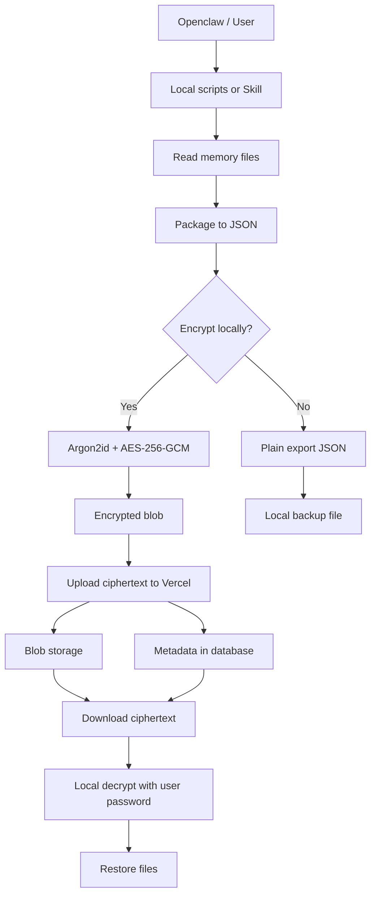

# 架构设计

[English Version](Architecture.en.md)

## 1. 目标

EternalClawMemory 的目标是在设备迁移、系统重装、工作区重建之后，仍然可以恢复 Openclaw 的长期记忆。

架构需要同时满足两件事：

1. 对用户来说备份、同步、恢复足够方便
2. 当启用加密时，云端尽量无法看到任何记忆明文

## 2. 三层结构

### 本地客户端层

负责：

- 读取 `Agent.md`、`memory.md`、`Soul.md`
- 打包成结构化 JSON
- 在本地执行可选加密
- 在本地执行解密
- 把内容恢复回工作区

### 云服务层

计划部署在 Vercel，负责：

- 用户注册与登录
- 会话与授权检查
- 元数据管理
- 密文记录上传与下载
- 每个账号最多 3 个 Agent 槽位的管理

### 存储层

负责保存：

- 用户、会话、槽位和元数据
- 加密后的 blob
- 后续可选的审计日志和同步事件

## 3. 数据流

## 4. 当前已实现模块

- `scripts/crypto_utils.py`: 加密核心
- `scripts/backup_local.py`: 本地明文导出
- `scripts/backup_secure.py`: 本地加密导出
- `scripts/restore_local.py`: 本地明文恢复
- `scripts/restore_secure.py`: 通过 URL 下载并本地解密恢复
- `skills/memory-sync`: Openclaw Skill 封装

## 5. 规划中的云架构

### Web 层

将从静态落地页逐步演进为：

- 首页
- Getting Started 文档页
- 登录 / 注册页
- 用户 Dashboard
- Agent 槽位管理页面
- 记忆上传、选择与恢复页面

### 后端层

预期提供：

- 认证接口
- 槽位管理接口
- 密文上传、列出、下载接口
- 安全验证和访问控制

### 数据库层

核心实体：

- `users`
- `sessions`
- `agent_slots`
- `memory_records`
- `memory_versions`
- `sync_events`

## 6. 安全边界

### 云端可以知道

- 用户身份
- 槽位归属
- blob 地址
- 上传时间
- 文件大小和标签等元数据

### 云端不应该知道

- 记忆明文
- 本地解密后的文件内容
- 用户的本地解密密码明文

## 7. 产品约束

- 每个账号最多同步 3 个 Agent
- 云端主要存储密文，而不是明文
- 本地设备是解密信任根
- 网站文档、README 和 Skill 说明必须保持一致
